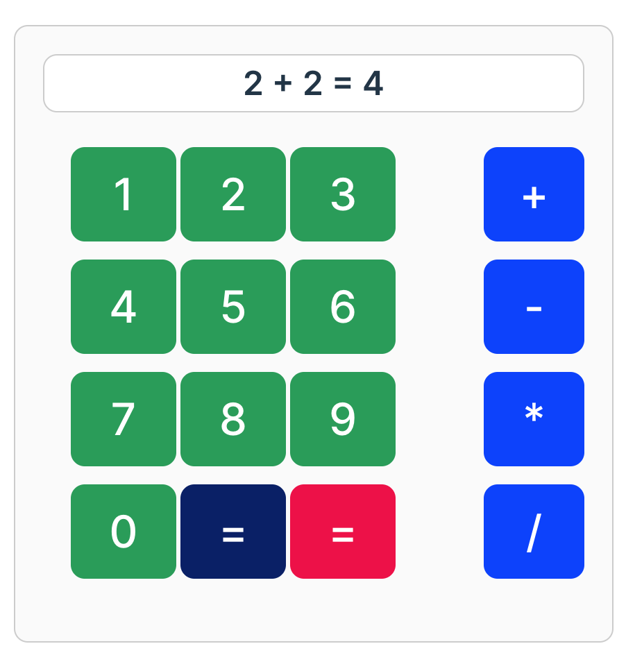

# Create an interactive calculator component
In this activity you will create an `InteractiveCalculator` component that will render a calculator component that allows the user to interact with it in order to perform arithmetic operations.

## Getting started
In order to get started, run `npm install` from within this folder to get all the dependencies installed. Once you've completed installation of all the dependencies, run `npm run dev` to start the development server.

## Your challenge
Create an `InteractiveCalculator` React component that will render a calculator component that allows the user to interact with it in order to perform arithmetic operations.

The component will display a calculator component that looks like the following:

### Pahse 1: Design the calculator

### Phase 2: Make the buttons clickable

### Phase 3: Show the first number in the display

### Phase 4: Show the operator in the display

### Phase 5: Show the second number in the display

### Phase 6: Show the result in the display

### Phase 7: Make the reset button work

## Tips and best practices
- Components should live inside a `components` folder.
- Each component should have its own file with the file name matching the component's name

# React + Vite

This template provides a minimal setup to get React working in Vite with HMR and some ESLint rules.

Currently, two official plugins are available:

- [@vitejs/plugin-react](https://github.com/vitejs/vite-plugin-react/blob/main/packages/plugin-react/README.md) uses [Babel](https://babeljs.io/) for Fast Refresh
- [@vitejs/plugin-react-swc](https://github.com/vitejs/vite-plugin-react-swc) uses [SWC](https://swc.rs/) for Fast Refresh
